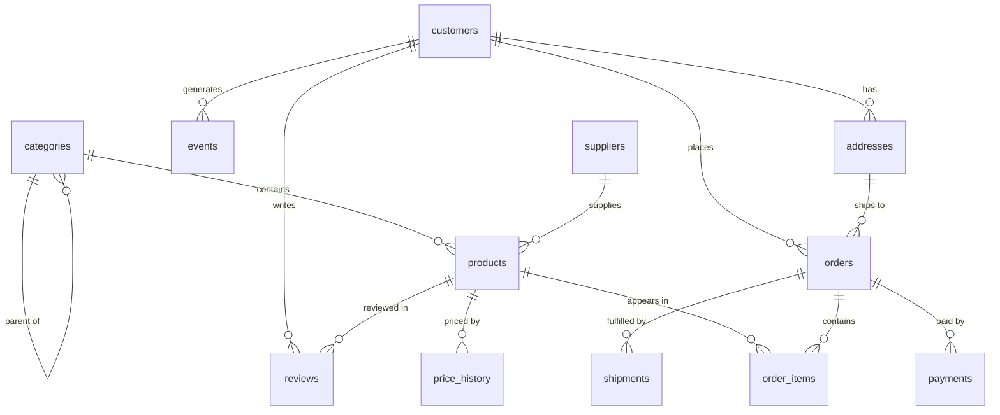

# The Nordkart Dataset — Schema Reference

Every module in this course runs against the same database: **`shop.db`**, the
operational database of *Nordkart*, a fictional online outdoor-gear retailer
based in Scandinavia. It contains ~3.5 years of business history
(2023-01-01 → 2026-07-14): customers, a product catalog, orders, payments,
shipments, product reviews, and website clickstream events.

The data is synthetic but deliberately realistic: revenue grows over time,
November/December (holidays) and June/July (hiking season) are busier, a few
customers are power buyers while most order once or twice, some products never
sell, and there are NULLs and edge cases exactly where real operational data
has them.

## Rebuilding the database

The database is fully reproducible. If you ever break it (some modules ask you
to experiment destructively — on a copy), rebuild it from the repo root:

```bash
rm -f shop.db
sqlite3 shop.db < data/seed.sql
```

`data/seed.sql` itself is generated by `data/generate_data.py` (deterministic,
seeded — rerunning it reproduces the identical dataset).

## Entity-relationship diagram



## Tables

### customers — 800 rows
| column | type | notes |
|---|---|---|
| customer_id | INTEGER | primary key |
| first_name, last_name | TEXT | |
| email | TEXT | UNIQUE, NOT NULL |
| phone | TEXT | **NULL for ~29% of customers** |
| country, city | TEXT | 10 countries, Nordics-heavy |
| marketing_opt_in | INTEGER | 0/1 flag |
| created_at | TEXT | account creation; can predate the order history window |

### addresses — 1,114 rows
| column | type | notes |
|---|---|---|
| address_id | INTEGER | primary key |
| customer_id | INTEGER | FK → customers |
| line1, city, postal_code, country | TEXT | |
| is_default | INTEGER | exactly one default per customer |

### categories — 25 rows (self-referencing tree)
| column | type | notes |
|---|---|---|
| category_id | INTEGER | primary key |
| name | TEXT | UNIQUE |
| parent_category_id | INTEGER | FK → categories; **NULL for the 6 top-level categories** (Camping, Climbing, Hiking, Winter Sports, Water Sports, Apparel); 19 child categories below them |

### suppliers — 40 rows
| column | type | notes |
|---|---|---|
| supplier_id | INTEGER | primary key |
| name | TEXT | UNIQUE |
| country | TEXT | |
| contact_email | TEXT | |

### products — 350 rows
| column | type | notes |
|---|---|---|
| product_id | INTEGER | primary key |
| sku | TEXT | UNIQUE, format `NK-<category>-<id>` |
| name | TEXT | |
| category_id | INTEGER | FK → categories (always a *child* category) |
| supplier_id | INTEGER | FK → suppliers |
| unit_price | REAL | **current** list price |
| unit_cost | REAL | what Nordkart pays the supplier |
| is_active | INTEGER | 26 products are discontinued (0) |
| introduced_at | TEXT | when the product entered the catalog |

### price_history — 722 rows
| column | type | notes |
|---|---|---|
| price_id | INTEGER | primary key |
| product_id | INTEGER | FK → products |
| price | REAL | |
| valid_from | TEXT | |
| valid_to | TEXT | **NULL = currently valid**; the current row's price equals products.unit_price |

Non-overlapping validity ranges per product — a classic slowly-changing
dimension (SCD type 2) shape.

### orders — 6,000 rows
| column | type | notes |
|---|---|---|
| order_id | INTEGER | primary key |
| customer_id | INTEGER | FK → customers |
| address_id | INTEGER | FK → addresses (shipping address) |
| status | TEXT | `pending` (63) · `paid` (90) · `shipped` (153) · `delivered` (5207) · `cancelled` (315) · `returned` (172) |
| shipping_cost | REAL | 0 for free-shipping orders |
| ordered_at | TEXT | 2023-01-01 → 2026-07-14, growth + seasonality |

### order_items — 13,475 rows
| column | type | notes |
|---|---|---|
| order_id | INTEGER | composite PK (order_id, product_id), FK → orders |
| product_id | INTEGER | FK → products |
| quantity | INTEGER | ≥ 1 |
| unit_price | REAL | **price at the time of the order** — often differs from products.unit_price; consistent with price_history |
| discount_pct | INTEGER | 0–20 |

### payments — 6,167 rows
| column | type | notes |
|---|---|---|
| payment_id | INTEGER | primary key |
| order_id | INTEGER | FK → orders |
| amount | REAL | **negative for refunds** (172 refunds, matching returned orders) |
| method | TEXT | card / paypal / klarna / bank_transfer / refund |
| status | TEXT | captured / failed (342) / pending |
| paid_at | TEXT | |

An order can have multiple payment rows: a failed attempt followed by a
successful one, or a capture followed by a refund. Cancelled orders have none.

### shipments — 5,532 rows
| column | type | notes |
|---|---|---|
| shipment_id | INTEGER | primary key |
| order_id | INTEGER | FK → orders |
| carrier | TEXT | PostNord / DHL / UPS / Bring / DPD |
| shipped_at | TEXT | |
| delivered_at | TEXT | **NULL = still in transit** (153 rows) |

### reviews — 3,331 rows
| column | type | notes |
|---|---|---|
| review_id | INTEGER | primary key |
| product_id | INTEGER | FK → products; UNIQUE (product_id, customer_id) |
| customer_id | INTEGER | FK → customers |
| rating | INTEGER | 1–5, skewed positive |
| review_text | TEXT | **NULL for ~35%** (rating-only reviews) |
| created_at | TEXT | a few reviews trail the order window by a day (written just after 2026-07-14) |

### events — 16,364 rows (clickstream)
| column | type | notes |
|---|---|---|
| event_id | INTEGER | primary key |
| customer_id | INTEGER | FK → customers |
| event_type | TEXT | page_view / add_to_cart / begin_checkout / search |
| product_id | INTEGER | **NULL** for search and begin_checkout events |
| occurred_at | TEXT | events cluster into browsing sessions (bursts separated by long gaps) — there is deliberately **no session_id column**; deriving one is a Module 11 exercise |

## Conventions

- **Dates/times** are TEXT in ISO-8601 format (`YYYY-MM-DD HH:MM:SS`), SQLite's
  idiomatic choice. They sort and compare correctly as strings and work with
  SQLite's date functions (`date()`, `strftime()`, `julianday()`).
- **Money** is REAL for simplicity. Real production systems use integer cents
  or `NUMERIC`/`DECIMAL` — Module 7 discusses why. Always `ROUND(x, 2)` for
  display.
- **Booleans** are INTEGER 0/1 with CHECK constraints (SQLite has no boolean
  type).
- **Foreign keys** are declared but only *enforced* when
  `PRAGMA foreign_keys = ON;` is set for your connection (Module 8 covers this).

## Deliberate quirks (they are features, not bugs)

| quirk | why it's there |
|---|---|
| 125 customers have never ordered | LEFT JOIN / anti-join exercises |
| 41 products have never sold | LEFT JOIN, NOT EXISTS |
| 231 customers have NULL phone | NULL semantics |
| order_items.unit_price ≠ products.unit_price | historical prices; point-in-time join exercises against price_history |
| refunds are negative payment amounts | SUM pitfalls, net-vs-gross revenue |
| failed payments precede successful retries | dedup / "latest row per group" |
| cancelled orders have no payments | anti-joins, revenue correctness |
| shipments.delivered_at NULL while in transit | NULL date arithmetic |
| events has no session_id | gaps-and-islands sessionization |
| categories is a tree | recursive CTEs |

## Canonical metric definitions

Every module (and the solutions) uses the same business definitions. Learn
them once:

- **Item revenue** of an order line:
  `quantity * unit_price * (1 - discount_pct / 100.0)`
- **Order total**: sum of the order's item revenue + `shipping_cost`.
- **Gross revenue** over a period: sum of item revenue for orders placed in the
  period **excluding cancelled orders** (returned orders count in gross).
- **Net revenue**: gross revenue minus refunded item revenue (returned orders
  excluded entirely, or equivalently gross + negative refund amounts on the
  payments side).
- **Active customer** (in a period): placed at least one non-cancelled order in
  the period.
- **AOV (average order value)**: average order total across non-cancelled
  orders.
