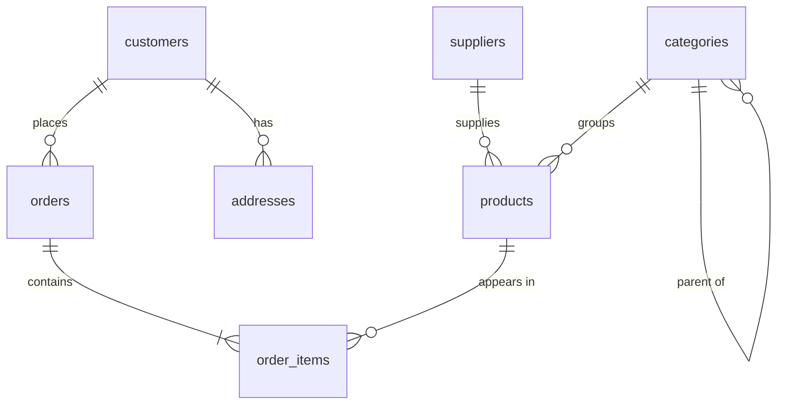
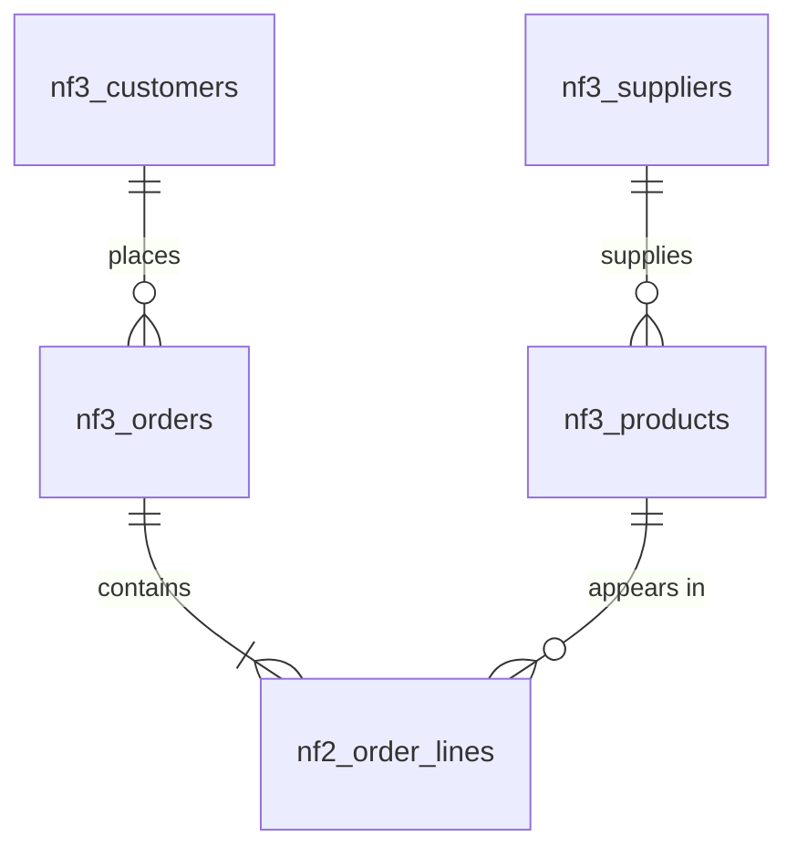
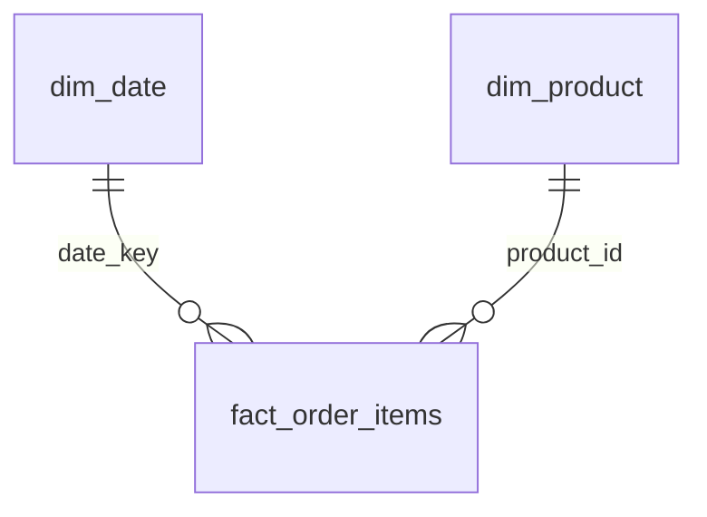

# Module 7 — Data Modeling

Every query you have written so far ran against a schema someone else designed. This module puts you on the other side of the table: given a business, how do you decide what tables exist, what their keys are, and where each fact lives? These decisions are the highest-leverage ones a data engineer makes — a good schema makes correct queries easy and wrong ones hard, while a bad schema silently corrupts data for years before anyone notices. We'll re-derive Nordkart's schema from a single messy spreadsheet, then deliberately bend the rules the other way and build an analytics-friendly star schema.

This module creates tables and modifies data, so it works on a **copy** of the database from the very start. From the course root:

```bash
cp shop.db scratch.db
sqlite3 -box scratch.db
```

**Every SQL block in this module runs against `scratch.db`**, never against `shop.db`. If you ever want a clean slate, exit and re-copy.

## What you'll learn

- How to turn business requirements into entities, attributes, and relationships
- How to read and draw ER diagrams (crow's foot notation, in mermaid)
- Choosing primary keys: natural vs surrogate, and composite keys
- What a foreign key actually promises — and what it doesn't
- Cardinality (1:1, 1:N, M:N) and junction tables; you'll design one yourself
- Normalization by doing: watch a flat spreadsheet corrupt itself, then decompose it through 1NF → 2NF → 3NF until Nordkart's real schema falls out
- When to break the rules on purpose: snapshot columns and read-optimized shapes
- OLTP vs OLAP workloads, and dimensional modeling (star schemas, facts, dimensions, grain)
- Building a real star schema with CTAS + a recursive-CTE date dimension
- Why `REAL` is a dubious type for money, and what to use instead
- Modeling optional data: nullable column or separate table?

## 7.1 From business to tables: entities, attributes, relationships

Schema design starts before any SQL. You listen to how the business talks: *"Customers place orders. An order contains products. Products come from suppliers and belong to a category. We ship orders and take payments; sometimes we refund them."*

The nouns that have identity and a life cycle of their own are **entities** — customer, order, product, supplier, category, shipment, payment. Facts that describe an entity but have no independent life are **attributes** — a customer's email, a product's price. The verbs connecting nouns are **relationships** — *places*, *contains*, *supplies*.

As a first approximation: one entity → one table, one attribute → one column, and relationships → foreign keys (or, as we'll see, sometimes whole tables). Nordkart's designers did exactly this:

```sql
SELECT name
FROM sqlite_schema
WHERE type = 'table' AND name NOT LIKE 'sqlite_%'
ORDER BY name;
```

```text
╭───────────────╮
│     name      │
╞═══════════════╡
│ addresses     │
│ categories    │
│ customers     │
│ events        │
│ order_items   │
│ orders        │
│ payments      │
│ price_history │
│ products      │
│ reviews       │
│ shipments     │
│ suppliers     │
╰───────────────╯
```

Eleven of the twelve map to a noun you'd hear in a meeting. The odd one out is `order_items` — it isn't a business noun, it's a *relationship made into a table*. Section 7.5 explains why some relationships need that.

## 7.2 Reading and drawing ER diagrams

An **entity-relationship (ER) diagram** shows entities as boxes and relationships as annotated lines. The industry-standard annotations are "crow's feet": the line endings encode how many rows on each side may participate. In mermaid syntax (which renders in most Markdown viewers, and which `DATASET.md` uses):



Reading the symbols on each end of a line: `||` means *exactly one*, `o{` means *zero or more*, `|{` means *one or more*. So `customers ||--o{ orders` reads: every order belongs to exactly one customer; a customer has zero or more orders. Note `categories` relating to itself — a self-referencing hierarchy (you queried it with recursive CTEs in Module 5).

A diagram is a set of claims about the data, and claims can be checked. Let's verify the `customers ||--o{ orders` line:

```sql
SELECT
    (SELECT COUNT(*) FROM orders WHERE customer_id IS NULL) AS orders_without_customer,
    (SELECT COUNT(*) FROM customers AS c
     WHERE NOT EXISTS (SELECT 1 FROM orders AS o WHERE o.customer_id = c.customer_id))
        AS customers_without_orders,
    (SELECT MAX(n) FROM (SELECT COUNT(*) AS n FROM orders GROUP BY customer_id))
        AS max_orders_per_customer;
```

```text
╭─────────────────────────┬──────────────────────────┬─────────────────────────╮
│ orders_without_customer │ customers_without_orders │ max_orders_per_customer │
╞═════════════════════════╪══════════════════════════╪═════════════════════════╡
│                       0 │                      125 │                      51 │
╰─────────────────────────┴──────────────────────────┴─────────────────────────╯
```

Exactly as drawn: no orphan orders (`||` on the customer side, backed by a `NOT NULL` foreign key), and "zero or more" is real — 125 customers have never ordered, one has ordered 51 times. Get in the habit of validating a diagram against the data it claims to describe; inherited documentation lies more often than you'd hope.

## 7.3 Primary keys: natural, surrogate, composite

A **primary key (PK)** is the column (or columns) that uniquely identifies a row, forever. Two candidate strategies:

- A **natural key** is a real-world attribute that happens to be unique — a customer's email, a product's SKU, a country's ISO code.
- A **surrogate key** is a meaningless number the database invents — `customer_id`, `product_id`.

Could Nordkart have used `email` as the customers PK? Mechanically, yes:

```sql
SELECT
    COUNT(*)              AS total_customers,
    COUNT(DISTINCT email) AS distinct_emails,
    SUM(email IS NULL)    AS null_emails
FROM customers;
```

```text
╭─────────────────┬─────────────────┬─────────────╮
│ total_customers │ distinct_emails │ null_emails │
╞═════════════════╪═════════════════╪═════════════╡
│             800 │             800 │           0 │
╰─────────────────┴─────────────────┴─────────────╯
```

Unique, never NULL — a valid *candidate key*. But Nordkart still chose the surrogate `customer_id`, for three reasons that generalize:

1. **Natural keys change.** People change email addresses. A PK is copied into every referencing table (`orders`, `reviews`, `events`, …), so changing it means updating every copy, atomically. A surrogate never changes because it means nothing.
2. **Natural keys leak business assumptions.** "Every customer has exactly one email, and no two customers share one" is a policy, not a law of nature. Households share emails; support creates accounts with placeholder emails. When policy shifts, a key choice shouldn't be the thing that breaks.
3. **Keys get copied around.** A 4-byte integer in millions of `orders` and `events` rows is cheaper to store, index, and join than a 30-character string — and it isn't PII, which matters the moment order data flows into logs, exports, or analytics tools.

The right pattern is the one Nordkart uses: surrogate PK **plus** a `UNIQUE` constraint on the natural key (`email`, `sku`, supplier `name`). You keep stable joins *and* the business rule.

> **PostgreSQL note:** SQLite's `INTEGER PRIMARY KEY` is an alias for the built-in rowid and auto-assigns values. In PostgreSQL you'd write `customer_id BIGINT GENERATED ALWAYS AS IDENTITY PRIMARY KEY` (older codebases use `BIGSERIAL`).

### Composite keys

A key may span multiple columns. Look at how `order_items` is declared:

```sql
SELECT sql FROM sqlite_schema WHERE name = 'order_items';
```

```text
╭─────────────────────────────────────────────────────────────────────────────────────╮
│                                         sql                                         │
╞═════════════════════════════════════════════════════════════════════════════════════╡
│ CREATE TABLE order_items (                                                          │
│     order_id     INTEGER NOT NULL REFERENCES orders(order_id),                      │
│     product_id   INTEGER NOT NULL REFERENCES products(product_id),                  │
│     quantity     INTEGER NOT NULL CHECK (quantity > 0),                             │
│     unit_price   REAL NOT NULL CHECK (unit_price >= 0),   -- price at time of order │
│     discount_pct INTEGER NOT NULL DEFAULT 0 CHECK (discount_pct BETWEEN 0 AND 100), │
│     PRIMARY KEY (order_id, product_id)                                              │
│ )                                                                                   │
╰─────────────────────────────────────────────────────────────────────────────────────╯
```

`PRIMARY KEY (order_id, product_id)` — a **composite key**. Neither column alone is unique (an order has many products; a product is in many orders), but the *pair* is. That's also a design decision with teeth: the same product cannot appear on two lines of one order. Ordering three of something means `quantity = 3`, not three rows. Verify the pair really is unique:

```sql
SELECT COUNT(*) AS duplicate_pairs
FROM (
    SELECT order_id, product_id
    FROM order_items
    GROUP BY order_id, product_id
    HAVING COUNT(*) > 1
);
```

```text
╭─────────────────╮
│ duplicate_pairs │
╞═════════════════╡
│               0 │
╰─────────────────╯
```

## 7.4 Foreign keys are promises

A **foreign key (FK)** is a column that stores another table's PK, plus a declared promise: *every value here exists over there*. `orders.customer_id REFERENCES customers(customer_id)` promises you'll never find an order pointing at a customer who doesn't exist — which is precisely what makes joins trustworthy. Check the promise between `order_items` and `products`:

```sql
SELECT COUNT(*) AS orphan_lines
FROM order_items AS oi
LEFT JOIN products AS p ON p.product_id = oi.product_id
WHERE p.product_id IS NULL;
```

```text
╭──────────────╮
│ orphan_lines │
╞══════════════╡
│            0 │
╰──────────────╯
```

Zero orphans. Two nuances a professional should carry around:

- The promise is **directional**. Every order line points at a real product; nothing promises every product appears in an order line (41 never do — that's fine, and it's why `LEFT JOIN` exists).
- A promise is only as good as its **enforcement**. SQLite declares FKs but only enforces them if your connection sets `PRAGMA foreign_keys = ON` — Module 8 covers this and what happens on `DELETE`. Design-wise, though, you should *declare* every FK regardless: it documents the relationship for humans and tools even before enforcement enters the picture.

> **PostgreSQL note:** PostgreSQL always enforces declared foreign keys — there is no off switch to forget. This is one of the most common surprises when moving code from SQLite to Postgres: inserts that "worked" start failing, correctly.

## 7.5 Cardinality: 1:1, 1:N, M:N and junction tables

Every relationship has a **cardinality** — how many rows on each side can participate:

- **1:N (one-to-many)** — the workhorse. One customer, many orders. Implementation: FK on the *many* side (`orders.customer_id`).
- **1:1 (one-to-one)** — rare; used to split off optional or sensitive attribute groups. Implementation: FK that is also a PK or `UNIQUE`. (Exercise 7 has you design one.)
- **M:N (many-to-many)** — one order contains many products; one product appears in many orders. No FK placement can express this: a FK column holds *one* value, and an M:N needs many-to-many pointers in both directions.

The solution to M:N is a **junction table** (also: bridge, associative, link table): a table whose rows *are* the relationship. `order_items` is exactly that — its composite PK is the pair of FKs, and it works as a pivot between the two sides:

```sql
SELECT
    COUNT(DISTINCT order_id)   AS orders_involved,
    COUNT(DISTINCT product_id) AS products_involved,
    COUNT(*)                   AS order_product_pairs
FROM order_items;
```

```text
╭─────────────────┬───────────────────┬─────────────────────╮
│ orders_involved │ products_involved │ order_product_pairs │
╞═════════════════╪═══════════════════╪═════════════════════╡
│            6000 │               309 │               13475 │
╰─────────────────┴───────────────────┴─────────────────────╯
```

6,000 orders and 309 products connected by 13,475 pairs. Notice `order_items` also carries `quantity`, `unit_price`, `discount_pct` — attributes that belong to *the relationship itself*, not to either side. A junction table is the natural home for such payload.

Let's design a second junction table ourselves. Product asks for wishlists: *a customer saves products to buy later*. Customer↔product, clearly M:N:

```sql
CREATE TABLE wishlist_items (
    customer_id INTEGER NOT NULL REFERENCES customers(customer_id),
    product_id  INTEGER NOT NULL REFERENCES products(product_id),
    added_at    TEXT NOT NULL,
    PRIMARY KEY (customer_id, product_id)
);
SELECT COUNT(*) AS wishlist_rows FROM wishlist_items;
```

```text
╭───────────────╮
│ wishlist_rows │
╞═══════════════╡
│             0 │
╰───────────────╯
```

The composite PK does real work here: a product can't be wishlisted twice by the same customer. `added_at` is relationship payload, like `quantity` in `order_items`. Populate and use it:

```sql
INSERT INTO wishlist_items (customer_id, product_id, added_at) VALUES
    (105, 11,  '2026-07-01 10:15:00'),
    (105, 137, '2026-07-03 21:40:00'),
    (684, 11,  '2026-07-05 08:02:00');
SELECT changes() AS rows_inserted;
```

```text
╭───────────────╮
│ rows_inserted │
╞═══════════════╡
│             3 │
╰───────────────╯
```

```sql
SELECT
    w.customer_id,
    p.name       AS product_name,
    p.unit_price AS price_today,
    w.added_at
FROM wishlist_items AS w
JOIN products AS p ON p.product_id = w.product_id
WHERE w.customer_id = 105
ORDER BY w.added_at;
```

```text
╭─────────────┬───────────────────────┬─────────────┬─────────────────────╮
│ customer_id │     product_name      │ price_today │      added_at       │
╞═════════════╪═══════════════════════╪═════════════╪═════════════════════╡
│         105 │ Nordic Tunnel Tent    │       698.9 │ 2026-07-01 10:15:00 │
│         105 │ Crag Big Wall Harness │       97.46 │ 2026-07-03 21:40:00 │
╰─────────────┴───────────────────────┴─────────────┴─────────────────────╯
```

The recognition rule: whenever you're tempted to put a *list* into a column ("products this order contains", "tags on this product"), you've found an M:N, and it wants a junction table. The Pitfalls section shows what happens if you ignore this.

## 7.6 Normalization: rescuing the orders spreadsheet

Here is the heart of the module. Imagine Nordkart before it had a database: orders lived in one big spreadsheet, one row per order, with the products crammed into a text column. We can reconstruct that spreadsheet faithfully from our data:

```sql
CREATE TABLE orders_sheet AS
SELECT
    o.order_id,
    DATE(o.ordered_at)                 AS order_date,
    c.first_name || ' ' || c.last_name AS customer_name,
    c.email                            AS customer_email,
    c.city                             AS customer_city,
    GROUP_CONCAT(p.name || ' x' || oi.quantity, '; ' ORDER BY p.name) AS items
FROM orders AS o
JOIN customers   AS c  ON c.customer_id = o.customer_id
JOIN order_items AS oi ON oi.order_id   = o.order_id
JOIN products    AS p  ON p.product_id  = oi.product_id
GROUP BY o.order_id;
SELECT COUNT(*) AS spreadsheet_rows FROM orders_sheet;
```

```text
╭──────────────────╮
│ spreadsheet_rows │
╞══════════════════╡
│             6000 │
╰──────────────────╯
```

```sql
SELECT order_id, customer_name, items
FROM orders_sheet
ORDER BY order_id
LIMIT 3;
```

```text
╭──────────┬──────────────────┬──────────────────────────────────────────────────────────────────────────────────────────────────────────────────────╮
│ order_id │  customer_name   │                                                        items                                                         │
╞══════════╪══════════════════╪══════════════════════════════════════════════════════════════════════════════════════════════════════════════════════╡
│        1 │ Mats Lundgren    │ Basecamp Dome Tent x1; Packrat Hydration Pack x1; Rescue Avalanche Beacon x3; Storm Rain Jacket x2; Storm Tent 3P x1 │
│        2 │ Sonja Pettersson │ Basecamp Tent 3P x1                                                                                                  │
│        3 │ Javier Lager     │ Flex Folding Poles x1; Merino Base Layer Top x1; Randonee Ski Skins x1                                               │
╰──────────┴──────────────────┴──────────────────────────────────────────────────────────────────────────────────────────────────────────────────────╯
```

Recognizable? It should be — half the world's operational data still looks like this. Now let's find out why it can't be trusted.

### 7.6.1 First normal form: atomic values, no repeating groups

**1NF** requires every column to hold one atomic value — no lists, no "item1/item2/item3" column families (a *repeating group* spread across columns is the same disease in a different shape). The `items` column violates it, and the price is that the database can no longer see individual products. Even a simple question — how many orders contained a Titan Stove? — degenerates into string matching:

```sql
SELECT COUNT(*) AS orders_with_titan_stove
FROM orders_sheet
WHERE items LIKE '%Titan Stove%';
```

```text
╭─────────────────────────╮
│ orders_with_titan_stove │
╞═════════════════════════╡
│                     202 │
╰─────────────────────────╯
```

This one happens to return the right number — but only because no other product name contains "Titan Stove" as a substring. That is luck, not correctness, and the Pitfalls section shows the same pattern giving an answer that is wrong by **16x**. Quantities are worse: try summing units sold out of `'... x2; ... x1'` and you're writing a parser in SQL.

The 1NF fix: one row per order **line**, each value in its own typed column. This is the "flat table" most analysts actually export:

```sql
CREATE TABLE flat_orders AS
SELECT
    o.order_id,
    DATE(o.ordered_at)                 AS order_date,
    o.status,
    c.first_name || ' ' || c.last_name AS customer_name,
    c.email                            AS customer_email,
    c.city                             AS customer_city,
    c.country                          AS customer_country,
    p.sku,
    p.name                             AS product_name,
    cat.name                           AS category_name,
    s.name                             AS supplier_name,
    s.country                          AS supplier_country,
    oi.quantity,
    oi.unit_price,
    oi.discount_pct
FROM orders AS o
JOIN customers   AS c   ON c.customer_id   = o.customer_id
JOIN order_items AS oi  ON oi.order_id     = o.order_id
JOIN products    AS p   ON p.product_id    = oi.product_id
JOIN categories  AS cat ON cat.category_id = p.category_id
JOIN suppliers   AS s   ON s.supplier_id   = p.supplier_id;
SELECT COUNT(*) AS flat_rows FROM flat_orders;
```

```text
╭───────────╮
│ flat_rows │
╞═══════════╡
│     13475 │
╰───────────╯
```

Better — every value is atomic, and aggregation works. But look what one busy customer does to it:

```sql
SELECT order_id, customer_name, customer_email, product_name, quantity
FROM flat_orders
WHERE customer_email = 'birgitta.berg@fastmail.com'
ORDER BY order_id
LIMIT 5;
```

```text
╭──────────┬───────────────┬────────────────────────────┬───────────────────────┬──────────╮
│ order_id │ customer_name │       customer_email       │     product_name      │ quantity │
╞══════════╪═══════════════╪════════════════════════════╪═══════════════════════╪══════════╡
│      204 │ Birgitta Berg │ birgitta.berg@fastmail.com │ Scout Map Case        │        1 │
│      204 │ Birgitta Berg │ birgitta.berg@fastmail.com │ Core Rope 60m         │        1 │
│      204 │ Birgitta Berg │ birgitta.berg@fastmail.com │ Storm Ultralight Tent │        1 │
│      211 │ Birgitta Berg │ birgitta.berg@fastmail.com │ Lock Belay Device     │        3 │
│      284 │ Birgitta Berg │ birgitta.berg@fastmail.com │ Pulse Probe 240cm     │        1 │
╰──────────┴───────────────┴────────────────────────────┴───────────────────────┴──────────╯
```

```sql
SELECT customer_email, COUNT(*) AS copies_of_customer_details
FROM flat_orders
GROUP BY customer_email
ORDER BY copies_of_customer_details DESC
LIMIT 3;
```

```text
╭────────────────────────────┬────────────────────────────╮
│       customer_email       │ copies_of_customer_details │
╞════════════════════════════╪════════════════════════════╡
│ birgitta.berg@fastmail.com │                        117 │
│ javier.gran@icloud.com     │                        115 │
│ marco.costa2@fastmail.com  │                        108 │
╰────────────────────────────┴────────────────────────────╯
```

Birgitta's name, email, city, and country are stored **117 times**. Redundancy isn't just wasted space — it's 117 opportunities for the copies to disagree. The classic failure modes have names: the **update anomaly**, the **delete anomaly**, and the **insert anomaly**. Let's trigger all three for real.

### 7.6.2 The three anomalies, demonstrated

**Update anomaly.** Birgitta changes her email address. The support tool edits the order it has on screen — order 204 — and calls it a day:

```sql
-- BAD: updates the copies on one order; 114 other copies still hold the old email
UPDATE flat_orders
SET customer_email = 'birgitta@bergfamily.no'
WHERE order_id = 204;
SELECT changes() AS rows_updated;
```

```text
╭──────────────╮
│ rows_updated │
╞══════════════╡
│            3 │
╰──────────────╯
```

```sql
SELECT customer_email, COUNT(*) AS order_lines
FROM flat_orders
WHERE customer_name = 'Birgitta Berg'
GROUP BY customer_email;
```

```text
╭────────────────────────────┬─────────────╮
│       customer_email       │ order_lines │
╞════════════════════════════╪═════════════╡
│ birgitta.berg@fastmail.com │         114 │
│ birgitta@bergfamily.no     │           3 │
╰────────────────────────────┴─────────────╯
```

The table now asserts two different emails for the same person, and there is no way — from the data alone — to know which is right. Nothing failed; no error was raised. That's what makes update anomalies vicious. (Updating all 117 rows atomically every time is the only correct move, and every writer must remember to do it, forever.)

**Delete anomaly.** Omar Andersson placed exactly one order (2742), then asks for it to be removed:

```sql
-- BAD: deleting Omar's only order erases Omar himself from the dataset
DELETE FROM flat_orders
WHERE order_id = 2742;
SELECT changes() AS rows_deleted;
```

```text
╭──────────────╮
│ rows_deleted │
╞══════════════╡
│            1 │
╰──────────────╯
```

```sql
SELECT COUNT(*) AS traces_of_omar
FROM flat_orders
WHERE customer_email = 'omar.andersson@gmail.com';
```

```text
╭────────────────╮
│ traces_of_omar │
╞════════════════╡
│              0 │
╰────────────────╯
```

Omar is gone — not just his order, *him*: his contact details, his account, his marketing consent. Because customer facts only existed as passengers on order rows, deleting the last order deletes the customer.

**Insert anomaly.** The inverse problem: Nordkart adds a new tent to the catalog. It hasn't sold yet, so there is no order row for its facts to ride on:

```sql
-- BAD: registering a never-sold product forces a half-empty ghost row
INSERT INTO flat_orders
    (sku, product_name, category_name, supplier_name, supplier_country, unit_price)
VALUES
    ('NK-02-0951', 'Aurora Ridge Tent', 'Tents', 'Fjellutstyr AS', 'Austria', 549.0);
SELECT order_id, order_date, customer_name, sku, product_name
FROM flat_orders
WHERE sku = 'NK-02-0951';
```

```text
╭──────────┬────────────┬───────────────┬────────────┬───────────────────╮
│ order_id │ order_date │ customer_name │    sku     │   product_name    │
╞══════════╪════════════╪═══════════════╪════════════╪═══════════════════╡
│          │            │               │ NK-02-0951 │ Aurora Ridge Tent │
╰──────────┴────────────┴───────────────┴────────────┴───────────────────╯
```

A "row in the orders table" with no order, no date, no customer. Every query that counts orders now has to remember to filter these ghosts out. (A `CREATE TABLE ... AS` table has no constraints, so nothing even tried to stop us — exactly like a spreadsheet.)

Our flat table is now corrupted in three distinct ways, and — the key insight — *the table itself can't tell us what the truth was*. We only recover because the normalized source still exists. Rebuild before continuing:

```sql
DROP TABLE flat_orders;
CREATE TABLE flat_orders AS
SELECT
    o.order_id,
    DATE(o.ordered_at)                 AS order_date,
    o.status,
    c.first_name || ' ' || c.last_name AS customer_name,
    c.email                            AS customer_email,
    c.city                             AS customer_city,
    c.country                          AS customer_country,
    p.sku,
    p.name                             AS product_name,
    cat.name                           AS category_name,
    s.name                             AS supplier_name,
    s.country                          AS supplier_country,
    oi.quantity,
    oi.unit_price,
    oi.discount_pct
FROM orders AS o
JOIN customers   AS c   ON c.customer_id   = o.customer_id
JOIN order_items AS oi  ON oi.order_id     = o.order_id
JOIN products    AS p   ON p.product_id    = oi.product_id
JOIN categories  AS cat ON cat.category_id = p.category_id
JOIN suppliers   AS s   ON s.supplier_id   = p.supplier_id;
SELECT COUNT(*) AS flat_rows FROM flat_orders;
```

```text
╭───────────╮
│ flat_rows │
╞═══════════╡
│     13475 │
╰───────────╯
```

### 7.6.3 Second normal form: no partial dependencies

Normalization is the cure, and it's driven by one idea: **every fact should be stored exactly once**, in a table whose key *determines* it. The tool for reasoning is the **functional dependency**: "X determines Y" (written X → Y) means that whenever two rows agree on X, they must agree on Y.

The key of `flat_orders` is `(order_id, sku)` — the same pair that keys `order_items`. **2NF** says: no non-key column may depend on just *part* of a composite key (a **partial dependency**). Audit our columns:

- `order_date`, `status`, `customer_*` → depend on `order_id` alone. Partial dependency.
- `product_name`, `category_name`, `supplier_*` → depend on `sku` alone. Partial dependency.
- `quantity`, `unit_price`, `discount_pct` → need the full pair (how many of *this product* on *this order*). These are fine.

We can even ask the data to confirm a dependency — if `sku` determines the product facts, no sku may show two variants of them:

```sql
SELECT COUNT(*) AS skus_with_conflicting_product_facts
FROM (
    SELECT sku
    FROM flat_orders
    GROUP BY sku
    HAVING COUNT(DISTINCT product_name)  > 1
        OR COUNT(DISTINCT category_name) > 1
        OR COUNT(DISTINCT supplier_name) > 1
);
```

```text
╭─────────────────────────────────────╮
│ skus_with_conflicting_product_facts │
╞═════════════════════════════════════╡
│                                   0 │
╰─────────────────────────────────────╯
```

The fix is decomposition: each partial dependency moves to its own table, keyed by the part it actually depends on. The pair-dependent columns stay behind:

```sql
CREATE TABLE nf2_orders AS
SELECT DISTINCT
    order_id, order_date, status,
    customer_name, customer_email, customer_city, customer_country
FROM flat_orders;

CREATE TABLE nf2_products AS
SELECT DISTINCT
    sku, product_name, category_name, supplier_name, supplier_country
FROM flat_orders;

CREATE TABLE nf2_order_lines AS
SELECT order_id, sku, quantity, unit_price, discount_pct
FROM flat_orders;

SELECT
    (SELECT COUNT(*) FROM nf2_orders)      AS orders,
    (SELECT COUNT(*) FROM nf2_products)    AS products,
    (SELECT COUNT(*) FROM nf2_order_lines) AS order_lines;
```

```text
╭────────┬──────────┬─────────────╮
│ orders │ products │ order_lines │
╞════════╪══════════╪═════════════╡
│   6000 │      309 │       13475 │
╰────────┴──────────┴─────────────╯
```

Product facts collapsed from 13,475 copies to 309 — one per product that ever sold. (This decomposition is **lossless**: joining the three tables back together reproduces `flat_orders` exactly. Normalization never throws information away; it only removes *duplicated* information.)

But we're not done. Watch:

```sql
SELECT COUNT(*) AS rows_holding_birgittas_details
FROM nf2_orders
WHERE customer_email = 'birgitta.berg@fastmail.com';
```

```text
╭────────────────────────────────╮
│ rows_holding_birgittas_details │
╞════════════════════════════════╡
│                             49 │
╰────────────────────────────────╯
```

Birgitta's details still appear 49 times — once per *order* now instead of once per order line. Progress, but the update anomaly is alive and well.

### 7.6.4 Third normal form: no transitive dependencies

The remaining problem: in `nf2_orders`, the key `order_id` determines `customer_email`, and `customer_email` determines `customer_name`, `customer_city`, `customer_country`. Key → non-key → non-key is a **transitive dependency**, and **3NF** forbids it: every non-key column must depend on the key *directly* — "the key, the whole key, and nothing but the key". Customer facts describe the customer, not the order, so they get their own table. Same story inside `nf2_products`: `sku → supplier_name → supplier_country` means supplier facts belong in a suppliers table.

```sql
CREATE TABLE nf3_customers AS
SELECT DISTINCT customer_email, customer_name, customer_city, customer_country
FROM nf2_orders;

CREATE TABLE nf3_orders AS
SELECT order_id, order_date, status, customer_email
FROM nf2_orders;

CREATE TABLE nf3_suppliers AS
SELECT DISTINCT supplier_name, supplier_country
FROM nf2_products;

CREATE TABLE nf3_products AS
SELECT sku, product_name, category_name, supplier_name
FROM nf2_products;

SELECT
    (SELECT COUNT(*) FROM nf3_customers) AS customers,
    (SELECT COUNT(*) FROM nf3_orders)    AS orders,
    (SELECT COUNT(*) FROM nf3_products)  AS products,
    (SELECT COUNT(*) FROM nf3_suppliers) AS suppliers;
```

```text
╭───────────┬────────┬──────────┬───────────╮
│ customers │ orders │ products │ suppliers │
╞═══════════╪════════╪══════════╪═══════════╡
│       675 │   6000 │      309 │        40 │
╰───────────┴────────┴──────────┴───────────╯
```

Now every fact lives exactly once. Birgitta's email change — the update that corrupted the flat table — becomes a one-row operation that *cannot* leave disagreeing copies:

```sql
SELECT COUNT(*) AS rows_to_change_for_new_email
FROM nf3_customers
WHERE customer_email = 'birgitta.berg@fastmail.com';
```

```text
╭──────────────────────────────╮
│ rows_to_change_for_new_email │
╞══════════════════════════════╡
│                            1 │
╰──────────────────────────────╯
```

The delete anomaly is fixed too — remove Omar's order from `nf3_orders` and his row in `nf3_customers` survives. And the insert anomaly: a new product is just a row in `nf3_products`, no ghost order required.

One last, telling comparison:

```sql
SELECT
    (SELECT COUNT(*) FROM nf3_customers) AS customers_recoverable_from_sheet,
    (SELECT COUNT(*) FROM customers)     AS customers_in_real_schema;
```

```text
╭──────────────────────────────────┬──────────────────────────╮
│ customers_recoverable_from_sheet │ customers_in_real_schema │
╞══════════════════════════════════╪══════════════════════════╡
│                              675 │                      800 │
╰──────────────────────────────────┴──────────────────────────╯
```

125 customers are *unrecoverable* from the spreadsheet — the ones who registered but never ordered. The spreadsheet world lost them the day they were created, because it had nowhere to put them. That's the insert anomaly operating silently at scale, for years.

### 7.6.5 What we rebuilt



Squint and this *is* Nordkart's schema: `customers`, `orders`, `order_items`, `products`, `suppliers`. The real schema differs only in refinements you now have the vocabulary for: surrogate keys replace our natural keys (`customer_id` for email, `product_id` for sku — section 7.3's tradeoffs); `category_name` gets promoted to a `categories` table with a self-referencing tree; addresses, payments, shipments, and reviews are further entities hanging off the same spine. Normalization isn't an academic ritual — it's the systematic removal of the three anomalies you watched happen, and it's how every serious operational (OLTP) schema ends up shaped.

(Beyond 3NF live BCNF, 4NF, 5NF — they handle rarer dependency shapes. For working engineers, "3NF with documented exceptions" is the norm, and the exceptions are the next section.)

## 7.7 Deliberate denormalization: the snapshot column

Now for a mature-engineer confession: Nordkart's real schema contains a column that *looks* like a normalization bug. `order_items.unit_price` duplicates pricing information that `products.unit_price` seemingly owns. Is the schema broken?

```sql
SELECT
    COUNT(*)                           AS order_lines,
    SUM(oi.unit_price <> p.unit_price) AS differ_from_current_price,
    ROUND(100.0 * SUM(oi.unit_price <> p.unit_price) / COUNT(*), 1) AS pct
FROM order_items AS oi
JOIN products    AS p ON p.product_id = oi.product_id;
```

```text
╭─────────────┬───────────────────────────┬──────╮
│ order_lines │ differ_from_current_price │ pct  │
╞═════════════╪═══════════════════════════╪══════╡
│       13475 │                      4005 │ 29.7 │
╰─────────────┴───────────────────────────┴──────╯
```

The two columns disagree on 30% of lines — and that's *correct*. They're different facts: `products.unit_price` is "what this costs **today**"; `order_items.unit_price` is "what the customer **agreed to pay** at checkout". Watch a price change ripple through real orders of the Vandra Backpack 70L:

```sql
SELECT price, valid_from, valid_to
FROM price_history
WHERE product_id = 338
ORDER BY valid_from;
```

```text
╭───────┬─────────────────────┬─────────────────────╮
│ price │     valid_from      │      valid_to       │
╞═══════╪═════════════════════╪═════════════════════╡
│ 68.37 │ 2023-06-17 21:35:03 │ 2024-03-27 05:16:00 │
│ 73.36 │ 2024-03-27 05:16:00 │ 2024-11-25 17:25:44 │
│ 85.45 │ 2024-11-25 17:25:44 │ 2025-06-15 19:26:07 │
│  86.5 │ 2025-06-15 19:26:07 │                     │
╰───────┴─────────────────────┴─────────────────────╯
```

```sql
SELECT oi.order_id, DATE(o.ordered_at) AS ordered_on, oi.unit_price
FROM order_items AS oi
JOIN orders AS o ON o.order_id = oi.order_id
WHERE oi.product_id = 338
  AND o.ordered_at >= '2024-11-01' AND o.ordered_at < '2024-12-15'
ORDER BY o.ordered_at;
```

```text
╭──────────┬────────────┬────────────╮
│ order_id │ ordered_on │ unit_price │
╞══════════╪════════════╪════════════╡
│     4316 │ 2024-11-06 │      73.36 │
│     2866 │ 2024-11-11 │      73.36 │
│     2890 │ 2024-11-23 │      73.36 │
│     5644 │ 2024-11-25 │      73.36 │
│     5702 │ 2024-11-28 │      85.45 │
│     5935 │ 2024-12-06 │      85.45 │
│     1862 │ 2024-12-10 │      85.45 │
│     2760 │ 2024-12-11 │      85.45 │
│     5016 │ 2024-12-14 │      85.45 │
╰──────────┴────────────┴────────────╯
```

The price rose on 2024-11-25 and every order line snapshotted the price in force at its moment. This is a **snapshot column** — denormalization *on purpose* — and it's safe because of one property: it is **immutable once written**. The agreed price of a placed order never changes retroactively, so the redundant copy can never drift out of sync with anything. Contrast that with copying, say, the customer's *current* city onto each order line: cities change, and the copies would rot. The test to apply, every time:

> **Copy a value only if it is a fact *about the moment of the event*, frozen at write time. Never copy a fact that the source table can later change.**

(Without the snapshot you'd reconstruct historical prices by joining `price_history` on time ranges — a point-in-time join, coming in Module 11. It works, but every revenue query pays the complexity; the snapshot makes the common case trivial. `shipping_cost` on `orders` is the same pattern.)

## 7.8 Two workloads, two shapes: OLTP vs OLAP

Everything so far optimizes for **OLTP** — online transaction processing: many small, concurrent reads and writes ("insert this order", "update this email"), each touching a few rows, where anomalies are fatal. Normalize hard.

Analytics — **OLAP**, online analytical processing — is the opposite workload: few queries, each scanning *millions* of rows, almost never writing. And in a normalized schema, every analytical question pays a join toll. Watch what "quarterly 2025 gross revenue for the Camping business" costs — remembering the canonical definitions: item revenue is `quantity * unit_price * (1 - discount_pct / 100.0)`, and gross revenue excludes cancelled orders:

```sql
SELECT
    (CAST(strftime('%m', o.ordered_at) AS INTEGER) + 2) / 3 AS quarter,
    ROUND(SUM(oi.quantity * oi.unit_price * (1 - oi.discount_pct / 100.0)), 2)
        AS gross_revenue
FROM orders AS o
JOIN order_items AS oi     ON oi.order_id        = o.order_id
JOIN products    AS p      ON p.product_id       = oi.product_id
JOIN categories  AS child  ON child.category_id  = p.category_id
JOIN categories  AS parent ON parent.category_id = child.parent_category_id
WHERE o.status <> 'cancelled'
  AND parent.name = 'Camping'
  AND o.ordered_at >= '2025-01-01' AND o.ordered_at < '2026-01-01'
GROUP BY quarter
ORDER BY quarter;
```

```text
╭─────────┬───────────────╮
│ quarter │ gross_revenue │
╞═════════╪═══════════════╡
│       1 │      31902.73 │
│       2 │      45413.03 │
│       3 │      70280.47 │
│       4 │      148842.1 │
╰─────────┴───────────────╯
```

Correct (note the Q4 holiday spike), but it took five tables, a self-join on the category tree, a date-string function, and the revenue formula inline — and every analyst writes some variation of this, every day, each with a fresh chance to forget the cancelled-order filter. When the *read* workload dominates, we reshape the data for reading. That's **dimensional modeling**.

## 7.9 A star schema for Nordkart

The dimensional playbook, due to Ralph Kimball, has three moves:

1. Pick a business process (ordering) and declare the **grain** — what one fact row means. Ours: *one order line*. Grain is the most important sentence in any analytics design; every column must be true at that grain.
2. Build a **fact table** at that grain: the FKs that locate the event (when, what, who) plus additive **measures** (quantity, revenue).
3. Build **dimension tables** — one wide, denormalized, human-readable table per axis of analysis ("by month", "by category", "by supplier country").

Facts are long and narrow (millions of rows, few columns); dimensions are short and wide. Drawn, the fact sits in the middle with dimensions around it — hence **star schema**:



Dimensions deliberately violate 3NF — `dim_product` will flatten product, category, parent category, and supplier into one table. That's safe for the same reason snapshots were: an analytics copy is rebuilt from the OLTP source on a schedule, not hand-edited, so update anomalies get overwritten at every refresh. (The refresh discipline *is* the safety mechanism — see Pitfall 3.)

### dim_date

A **date dimension** is a table with one row per calendar day and precomputed attributes. It replaces `strftime` gymnastics with joins, and — unlike the data — it contains days with no sales, which makes "show months including zeros" queries natural (Module 11 leans on this). A recursive CTE (Module 5) generates it:

```sql
CREATE TABLE dim_date AS
WITH RECURSIVE calendar(d) AS (
    SELECT DATE('2023-01-01')
    UNION ALL
    SELECT DATE(d, '+1 day') FROM calendar WHERE d < '2026-12-31'
)
SELECT
    d                                            AS date_key,
    CAST(strftime('%Y', d) AS INTEGER)           AS year,
    (CAST(strftime('%m', d) AS INTEGER) + 2) / 3 AS quarter,
    CAST(strftime('%m', d) AS INTEGER)           AS month,
    CAST(strftime('%d', d) AS INTEGER)           AS day_of_month,
    CAST(strftime('%w', d) AS INTEGER)           AS day_of_week,
    CASE WHEN strftime('%w', d) IN ('0', '6') THEN 1 ELSE 0 END AS is_weekend
FROM calendar;
SELECT COUNT(*) AS days, MIN(date_key) AS first_day, MAX(date_key) AS last_day
FROM dim_date;
```

```text
╭──────┬────────────┬────────────╮
│ days │ first_day  │  last_day  │
╞══════╪════════════╪════════════╡
│ 1461 │ 2023-01-01 │ 2026-12-31 │
╰──────┴────────────┴────────────╯
```

```sql
SELECT *
FROM dim_date
WHERE date_key BETWEEN '2025-12-24' AND '2025-12-28';
```

```text
╭────────────┬──────┬─────────┬───────┬──────────────┬─────────────┬────────────╮
│  date_key  │ year │ quarter │ month │ day_of_month │ day_of_week │ is_weekend │
╞════════════╪══════╪═════════╪═══════╪══════════════╪═════════════╪════════════╡
│ 2025-12-24 │ 2025 │       4 │    12 │           24 │           3 │          0 │
│ 2025-12-25 │ 2025 │       4 │    12 │           25 │           4 │          0 │
│ 2025-12-26 │ 2025 │       4 │    12 │           26 │           5 │          0 │
│ 2025-12-27 │ 2025 │       4 │    12 │           27 │           6 │          1 │
│ 2025-12-28 │ 2025 │       4 │    12 │           28 │           0 │          1 │
╰────────────┴──────┴─────────┴───────┴──────────────┴─────────────┴────────────╯
```

(`day_of_week`: 0 = Sunday, SQLite's `%w` convention. Real warehouses add holiday flags, fiscal periods, ISO weeks.)

> **PostgreSQL note:** no recursion needed — `SELECT generate_series('2023-01-01'::date, '2026-12-31'::date, '1 day')` produces the calendar directly.

### dim_product

One row per product, with the whole categorization chain flattened in:

```sql
CREATE TABLE dim_product AS
SELECT
    p.product_id,
    p.sku,
    p.name       AS product_name,
    child.name   AS category,
    parent.name  AS parent_category,
    s.name       AS supplier,
    s.country    AS supplier_country,
    p.unit_price AS current_price,
    p.is_active
FROM products AS p
JOIN categories      AS child  ON child.category_id  = p.category_id
LEFT JOIN categories AS parent ON parent.category_id = child.parent_category_id
JOIN suppliers       AS s      ON s.supplier_id      = p.supplier_id;
SELECT COUNT(*) AS products FROM dim_product;
```

```text
╭──────────╮
│ products │
╞══════════╡
│      350 │
╰──────────╯
```

```sql
SELECT product_id, product_name, category, parent_category, supplier_country
FROM dim_product
WHERE product_id IN (11, 338);
```

```text
╭────────────┬─────────────────────┬───────────┬─────────────────┬──────────────────╮
│ product_id │    product_name     │ category  │ parent_category │ supplier_country │
╞════════════╪═════════════════════╪═══════════╪═════════════════╪══════════════════╡
│         11 │ Nordic Tunnel Tent  │ Tents     │ Camping         │ Germany          │
│        338 │ Vandra Backpack 70L │ Backpacks │ Camping         │ Denmark          │
╰────────────┴─────────────────────┴───────────┴─────────────────┴──────────────────╯
```

(The `LEFT JOIN` on the parent is defensive: Nordkart products always sit in child categories, but a dimension build shouldn't silently drop rows if that ever changes.)

### fact_order_items

Grain: one row per order line. FKs to the dimensions, measures precomputed — including item revenue by the canonical formula:

```sql
CREATE TABLE fact_order_items AS
SELECT
    DATE(o.ordered_at) AS date_key,
    oi.order_id,
    oi.product_id,
    o.customer_id,
    o.status           AS order_status,
    oi.quantity,
    oi.unit_price,
    oi.discount_pct,
    oi.quantity * oi.unit_price * (1 - oi.discount_pct / 100.0) AS item_revenue
FROM order_items AS oi
JOIN orders      AS o ON o.order_id = oi.order_id;
SELECT COUNT(*) AS fact_rows FROM fact_order_items;
```

```text
╭───────────╮
│ fact_rows │
╞═══════════╡
│     13475 │
╰───────────╯
```

Design notes worth internalizing: `order_status` rides along so gross-revenue queries can apply the canonical cancelled-order filter without joining back to `orders`; `order_id` stays as a *degenerate dimension* (an identifier with no dimension table of its own); we keep **all** statuses in the fact and filter per-query, because baking a filter into the table silently narrows every future question it can answer.

### The payoff

The section 7.8 question again, star-style:

```sql
SELECT
    d.quarter,
    ROUND(SUM(f.item_revenue), 2) AS gross_revenue
FROM fact_order_items AS f
JOIN dim_date    AS d ON d.date_key   = f.date_key
JOIN dim_product AS p ON p.product_id = f.product_id
WHERE f.order_status <> 'cancelled'
  AND p.parent_category = 'Camping'
  AND d.year = 2025
GROUP BY d.quarter
ORDER BY d.quarter;
```

```text
╭─────────┬───────────────╮
│ quarter │ gross_revenue │
╞═════════╪═══════════════╡
│       1 │      31902.73 │
│       2 │      45413.03 │
│       3 │      70280.47 │
│       4 │      148842.1 │
╰─────────┴───────────────╯
```

Identical numbers, but the query is now a fact table, two one-hop joins, and three readable filters — no category self-join, no date arithmetic, no inline revenue formula to get wrong. Every question follows the same template: *filter dimensions, aggregate measures, group by dimension attributes*. That regularity is why BI tools, and tired analysts at 5 pm, love star schemas. One more, free of charge — do weekends outsell weekdays?

```sql
SELECT
    d.is_weekend,
    COUNT(DISTINCT f.order_id)    AS orders,
    ROUND(SUM(f.item_revenue), 2) AS gross_revenue
FROM fact_order_items AS f
JOIN dim_date AS d ON d.date_key = f.date_key
WHERE f.order_status <> 'cancelled'
  AND d.year = 2025
GROUP BY d.is_weekend;
```

```text
╭────────────┬────────┬───────────────╮
│ is_weekend │ orders │ gross_revenue │
╞════════════╪════════╪═══════════════╡
│          0 │   1469 │     803790.18 │
│          1 │    561 │      325554.6 │
╰────────────┴────────┴───────────────╯
```

Weekends contribute ~29% of 2025 gross revenue — almost exactly their 2-in-7 share of days. No weekend effect; good to know before someone proposes weekend-only ad spend.

> **PostgreSQL note:** `CREATE TABLE AS` works identically, but production warehouses usually use **materialized views** (`CREATE MATERIALIZED VIEW ... ; REFRESH MATERIALIZED VIEW ...`) so the rebuild-from-source step is a single built-in command.

## 7.10 Data types and money

Modeling isn't only tables and keys — each column's type is a small design decision, and money is where the default choice bites. Nordkart stores prices as `REAL`: IEEE-754 binary floating point. Binary floats cannot represent most decimal fractions exactly:

```sql
SELECT
    0.1 + 0.2                    AS should_be_0_3,
    19.99 * 100                  AS should_be_1999,
    CAST(19.99 * 100 AS INTEGER) AS truncated_cents;
```

```text
╭─────────────────────┬────────────────────┬─────────────────╮
│    should_be_0_3    │   should_be_1999   │ truncated_cents │
╞═════════════════════╪════════════════════╪═════════════════╡
│ 0.30000000000000004 │ 1998.9999999999998 │            1998 │
╰─────────────────────┴────────────────────┴─────────────────╯
```

That last column is a real bug from real codebases: converting €19.99 to cents with a truncating cast loses a cent. Equality checks (`WHERE total = 59.97`) fail unpredictably for the same reason. And errors *accumulate*:

```sql
WITH RECURSIVE pennies(n, total) AS (
    SELECT 1, 0.01
    UNION ALL
    SELECT n + 1, total + 0.01 FROM pennies WHERE n < 1000
)
SELECT total AS one_thousand_pennies FROM pennies WHERE n = 1000;
```

```text
╭──────────────────────╮
│ one_thousand_pennies │
╞══════════════════════╡
│   9.9999999999998313 │
╰──────────────────────╯
```

A thousand cents is exactly 10.00; float addition drifts by the 13th decimal after just a thousand rows. Harmless at Nordkart's scale with `ROUND(x, 2)` discipline (which this course applies to every money result) — but not something to build a ledger on. The professional options:

- **Integer minor units** ("integer cents"): store `1999`, not `19.99`. Exact arithmetic up to 2^53 in SQLite, format at the edges. This is the standard choice in SQLite, and common everywhere (Stripe's API works this way).

```sql
SELECT
    name,
    unit_price,
    CAST(ROUND(unit_price * 100) AS INTEGER) AS price_cents
FROM products
ORDER BY product_id
LIMIT 3;
```

```text
╭────────────────────────┬────────────┬─────────────╮
│          name          │ unit_price │ price_cents │
╞════════════════════════╪════════════╪═════════════╡
│ Merino Base Layer Top  │     106.69 │       10669 │
│ Wall Harness           │      83.69 │        8369 │
│ Guard Avalanche Beacon │     602.95 │       60295 │
╰────────────────────────┴────────────┴─────────────╯
```

(Note the `ROUND` before the `CAST` — that's the fix for the truncation bug above.)

- **Exact decimal types**, where the engine offers them. SQLite doesn't; most other databases do.

> **PostgreSQL note:** use `NUMERIC(12, 2)` for money — exact decimal arithmetic, no drift, and it's what accountants can audit. Avoid PostgreSQL's legacy `money` type (locale-dependent formatting, awkward casts). Analytics engines similarly offer `DECIMAL`.

## 7.11 Modeling missing data: nullable column or separate table?

Last design decision: where do *optional* facts live? Nordkart's `phone` is a nullable column on `customers`:

```sql
SELECT
    COUNT(*)           AS customers,
    SUM(phone IS NULL) AS phone_missing,
    ROUND(100.0 * SUM(phone IS NULL) / COUNT(*), 1) AS pct_missing
FROM customers;
```

```text
╭───────────┬───────────────┬─────────────╮
│ customers │ phone_missing │ pct_missing │
╞═══════════╪═══════════════╪═════════════╡
│       800 │           231 │        28.9 │
╰───────────┴───────────────┴─────────────╯
```

Reasonable — but recall from Module 2 that NULL is ambiguous: does it mean *has no phone*, *declined to share*, or *we never asked*? The alternative design moves the attribute to its own table, where **existence of a row** carries the meaning:

```sql
CREATE TABLE customer_phones (
    customer_id INTEGER PRIMARY KEY REFERENCES customers(customer_id),
    phone       TEXT NOT NULL
);
INSERT INTO customer_phones (customer_id, phone)
SELECT customer_id, phone
FROM customers
WHERE phone IS NOT NULL;
SELECT COUNT(*) AS phones_recorded FROM customer_phones;
```

```text
╭─────────────────╮
│ phones_recorded │
╞═════════════════╡
│             569 │
╰─────────────────╯
```

Note the shape: `customer_id` is both PK and FK — the 1:1 (strictly, 1:0..1) pattern. Inside this table `phone` can be `NOT NULL`, because a customer without a phone simply has no row. The rules of thumb:

- **Nullable column** when the attribute is single-valued, frequently present, and one kind of "missing" suffices — `phone`, `reviews.review_text`, `shipments.delivered_at` (where NULL crisply means *not yet*).
- **Separate table** when absence needs to be unambiguous, when the attribute group is large and rarely present (avoid a wide, mostly-NULL table), or when it might become multi-valued — a second phone number is an `INSERT` here, versus a schema migration (`phone2`?) there.
- **Never** allow NULL in a key column, and treat NULLable FKs (like `events.product_id`, NULL for searches) as a documented modeling choice: "this event isn't about a product" — Module 4 showed how they behave in joins.

## Pitfalls

### Pitfall 1: trusting a flat table with updates

The update anomaly from 7.6, in its most common working disguise: a support tool "fixes" a customer's name, but only on the rows it had loaded — the latest order:

```sql
-- BAD: fixes the spelling on the most recent order only; 111 rows keep the old name
UPDATE flat_orders
SET customer_name = 'Javier Grän'
WHERE customer_email = 'javier.gran@icloud.com'
  AND order_id = (SELECT MAX(order_id) FROM flat_orders
                  WHERE customer_email = 'javier.gran@icloud.com');
SELECT changes() AS rows_updated;
```

```text
╭──────────────╮
│ rows_updated │
╞══════════════╡
│            4 │
╰──────────────╯
```

No error — and now the revenue-by-customer report splits one human into two:

```sql
SELECT
    customer_name,
    COUNT(DISTINCT order_id) AS orders,
    ROUND(SUM(quantity * unit_price * (1 - discount_pct / 100.0)), 2) AS gross_revenue
FROM flat_orders
WHERE customer_email = 'javier.gran@icloud.com'
GROUP BY customer_name;
```

```text
╭───────────────┬────────┬───────────────╮
│ customer_name │ orders │ gross_revenue │
╞═══════════════╪════════╪═══════════════╡
│ Javier Gran   │     50 │      28176.97 │
│ Javier Grän   │      1 │        603.31 │
╰───────────────┴────────┴───────────────╯
```

Group by name (as flat-table reports invariably do) and Javier's lifetime value is understated by 603.31 under one identity and 28,176.97 under the other. **The fix is structural, not procedural**: in the normalized schema the name exists in exactly one row, so a partial update is impossible by construction:

```sql
UPDATE customers
SET last_name = 'Grän'
WHERE email = 'javier.gran@icloud.com';
SELECT changes() AS rows_updated;
```

```text
╭──────────────╮
│ rows_updated │
╞══════════════╡
│            1 │
╰──────────────╯
```

One row changed; every query, past and future, joins to the corrected name. (The same lesson covered the DELETE that erased Omar in 7.6.2 — normalization is what makes "correct" the only expressible option.)

### Pitfall 2: an M:N crammed into a comma-separated column

`orders_sheet.items` models the orders↔products M:N as a delimited string. Here's the trap in action — "how many orders included the Wall Harness?":

```sql
-- BAD: substring matching cannot tell 'Wall Harness' from 'Grip Big Wall Harness'
SELECT COUNT(*) AS orders_with_wall_harness
FROM orders_sheet
WHERE items LIKE '%Wall Harness%';
```

```text
╭──────────────────────────╮
│ orders_with_wall_harness │
╞══════════════════════════╡
│                      327 │
╰──────────────────────────╯
```

327 — believable, precise-looking, and wrong by a factor of 16. Nordkart's catalog contains five *other* products whose names end in "Big Wall Harness", and `LIKE` happily matches all of them:

```sql
SELECT order_id, items
FROM orders_sheet
WHERE items LIKE '%Big Wall Harness%'
ORDER BY order_id
LIMIT 3;
```

```text
╭──────────┬────────────────────────────────────────────────────────────────────────────────────────────────────────────────────────────────────────────────────╮
│ order_id │                                                                       items                                                                        │
╞══════════╪════════════════════════════════════════════════════════════════════════════════════════════════════════════════════════════════════════════════════╡
│        6 │ Grip Balaclava x1; Grip Big Wall Harness x1; Peak Ski Poles x2                                                                                     │
│       30 │ Basecamp Ultralight Tent x1; Crag Harness x1; Grip Big Wall Harness x1; Micro Carabiner x1; Nordic Ultralight Tent x1; Thermo Base Layer Bottom x3 │
│       39 │ Guard Probe 240cm x1; Via Big Wall Harness x1                                                                                                      │
╰──────────┴────────────────────────────────────────────────────────────────────────────────────────────────────────────────────────────────────────────────────╯
```

You can fight back with cleverer delimiters and boundary matching, but you're building a fragile parser to compensate for a modeling mistake — and quantities, prices, and joins remain out of reach inside the string. The junction table makes the question trivial and *exact*, because product identity is a key, not a substring:

```sql
SELECT COUNT(DISTINCT oi.order_id) AS orders_with_wall_harness
FROM order_items AS oi
JOIN products AS p ON p.product_id = oi.product_id
WHERE p.name = 'Wall Harness';
```

```text
╭──────────────────────────╮
│ orders_with_wall_harness │
╞══════════════════════════╡
│                       20 │
╰──────────────────────────╯
```

20, not 327. If a column in a schema review contains `;` or `,` as *structure*, stop the review: that's a junction table wearing a trench coat.

### Pitfall 3: derived copies go stale (and why the snapshot column doesn't)

Our star schema is a *derived copy* of the operational tables — which means it's frozen at build time. Watch it rot. The customer on order 10 (placed 2026-07-12, still `paid`, not yet shipped) calls to double a line's quantity, and operations updates the live table:

```sql
UPDATE order_items
SET quantity = 2
WHERE order_id = 10 AND product_id = 75;
SELECT changes() AS rows_updated;
```

```text
╭──────────────╮
│ rows_updated │
╞══════════════╡
│            1 │
╰──────────────╯
```

```sql
-- BAD: reading the fact table as if it were live
SELECT quantity, ROUND(item_revenue, 2) AS item_revenue
FROM fact_order_items
WHERE order_id = 10 AND product_id = 75;
```

```text
╭──────────┬──────────────╮
│ quantity │ item_revenue │
╞══════════╪══════════════╡
│        1 │       411.04 │
╰──────────┴──────────────╯
```

```sql
SELECT
    quantity,
    ROUND(quantity * unit_price * (1 - discount_pct / 100.0), 2) AS item_revenue
FROM order_items
WHERE order_id = 10 AND product_id = 75;
```

```text
╭──────────┬──────────────╮
│ quantity │ item_revenue │
╞══════════╪══════════════╡
│        2 │       822.08 │
╰──────────┴──────────────╯
```

The fact table reports 411.04; reality is 822.08. Nothing warned us — stale derived data *looks* exactly like fresh data. The fix is not to abandon derived tables (analytics needs them) but to make refresh a scheduled, boring, automated fact of life, and to state the staleness contract ("as of last night's load") wherever the numbers surface:

```sql
DROP TABLE fact_order_items;
CREATE TABLE fact_order_items AS
SELECT
    DATE(o.ordered_at) AS date_key,
    oi.order_id,
    oi.product_id,
    o.customer_id,
    o.status           AS order_status,
    oi.quantity,
    oi.unit_price,
    oi.discount_pct,
    oi.quantity * oi.unit_price * (1 - oi.discount_pct / 100.0) AS item_revenue
FROM order_items AS oi
JOIN orders      AS o ON o.order_id = oi.order_id;
SELECT quantity, ROUND(item_revenue, 2) AS item_revenue
FROM fact_order_items
WHERE order_id = 10 AND product_id = 75;
```

```text
╭──────────┬──────────────╮
│ quantity │ item_revenue │
╞══════════╪══════════════╡
│        2 │       822.08 │
╰──────────┴──────────────╯
```

Now contrast this with `order_items.unit_price`, the sanctioned snapshot from 7.7. Why does that copy never need refreshing? Because its source of truth is **the past event itself**, not a mutable table: "the price the customer agreed to" is written once and is immutable thereafter. `item_revenue` in the fact table, by contrast, derives from `quantity`, which the business *can* edit while an order is open. That's the whole taxonomy:

- Copy of an **immutable event fact** → safe forever (snapshot column).
- Copy of a **mutable current fact** → stale the moment the source changes; needs a refresh contract (derived/aggregate tables, caches, warehouse loads).

Know which one you're creating before you create it.

> **PostgreSQL note:** `REFRESH MATERIALIZED VIEW fact_order_items;` replaces the drop-and-recreate dance, and `REFRESH ... CONCURRENTLY` does it without blocking readers.

## Exercises

Answer design exercises with `CREATE TABLE` statements plus a few sentences of justification (keys, cardinalities, what's stored vs derived). Query exercises run against `scratch.db` *after* you've built the star schema in 7.9. No answers here — solutions live in `solutions/07-data-modeling.md`.

**Warm-up**

1. **Cardinality audit (design).** For each pair — `customers`↔`addresses`, `orders`↔`shipments`, `products`↔`suppliers` — state the cardinality (1:1, 1:N, or M:N), say which table carries the foreign key and why it must be that side, then write one query per pair confirming the data agrees with you.
2. **Fulfilment sanity check (query).** Logistics claims some orders ship in multiple parcels. Does any order actually have more than one shipment row? And which order statuses have *no* shipment at all — do those counts make business sense?
3. **A promise as a query (query).** The schema docs promise "every customer with at least one address has exactly one default address". Write the query that would list violators, and confirm it returns none.
4. **Natural key debate (design).** `suppliers.name` is `UNIQUE NOT NULL`. Give two concrete reasons Nordkart still uses `supplier_id` as the PK, and describe one realistic business event that would hurt if `name` were the key.

**Core**

5. **Gift cards (design).** Nordkart wants to sell gift cards: a card is bought for a fixed amount, may expire, and can be redeemed *partially, across several orders*. Design the tables. Decide explicitly: is the card's remaining balance a stored column or a derived value — and why (think Pitfall 3)?
6. **Product bundles (design).** Marketing wants a "Weekend Camping Kit": a product in its own right, composed of other products with quantities (1 tent, 1 backpack, 2 quilts). Design the structure without duplicating any product data. What cardinality is bundle↔component? Does the `order_items.unit_price` snapshot still work when someone orders a bundle?
7. **Customer settings (design).** Product wants per-customer preferences: newsletter frequency, preferred language, dark mode. Most customers will never touch them. Design this as a separate table rather than extra columns on `customers`, enforce the one-row-per-customer rule structurally, and justify the separate table in two sentences.
8. **Category league table (query).** Using **only** the star schema tables, rank the top 5 parent categories by 2024 gross revenue (canonical definition — remember what it excludes).
9. **Normalize the returns spreadsheet (design).** The returns team tracks refunds in a sheet with columns: `return_id`, `order_id`, `returned_at`, `customer_email`, `customer_name`, `items_returned` (e.g. `'NK-02-0011 x1; NK-05-0338 x2'`), `refund_total`, `carrier_name`, `carrier_phone`, `warehouse_code`, `warehouse_city`. Identify the 1NF violation, the functional dependencies, and one concrete anomaly it will suffer; then decompose to 3NF (DDL), reusing existing Nordkart tables where possible.

**Challenge**

10. **Slow seller, honest zeros (query).** Merchandising asks for the 2024 *monthly* sales of the 'Vandra Backpack 70L' — units and gross revenue — **including months where it sold nothing**. Use the star schema; `dim_date` is the key to the zero months.
11. **To snapshot or not (design).** Finance wants per-line profit margins, but `products.unit_cost` only stores the *current* cost, and supplier costs change. Should `order_items` snapshot `unit_cost` at order time, like it does `unit_price`? Apply the immutability test from 7.7, decide, and describe what an honest backfill for historical orders can and cannot do.
12. **dim_customer (design + build).** Design and build (CTAS) a `dim_customer` for the star schema. Which `customers` columns belong, which don't (consider PII and key stability from 7.3), and why must `lifetime_spend` — which the analysts will beg for — *not* be a column here? Verify the row count matches `customers`.

## Key takeaways

- **Entities → tables, attributes → columns, relationships → FKs**; M:N relationships → junction tables (composite PK of two FKs + relationship payload).
- **ER diagrams are claims** — read `||`/`o{` as exactly-one/zero-or-more, and verify claims against data.
- **Prefer surrogate PKs + UNIQUE natural keys**: surrogates never change, don't leak PII, join cheap; the UNIQUE keeps the business rule.
- **FKs are directional promises** ("every value here exists there"), only as good as their enforcement (`PRAGMA foreign_keys = ON` in SQLite; always-on in PostgreSQL).
- **Normalization = every fact exactly once**: 1NF atomic values (no lists in columns) → 2NF no partial dependency on a composite key → 3NF no transitive (key → non-key → non-key) dependency. It exists to kill the update/delete/insert anomalies — which you have now caused personally.
- **Denormalize deliberately, never accidentally**: snapshot columns are safe iff immutable-once-written (`order_items.unit_price`); copies of mutable facts need a refresh contract.
- **OLTP normalizes for writes; OLAP reshapes for reads.** Star schema: fact table at a declared grain (FKs + additive measures) surrounded by wide denormalized dimensions; build with CTAS, `dim_date` via recursive CTE (or `generate_series` in PG); rebuilt on schedule.
- **State the grain** of every fact table in one sentence; keep all rows and filter per-query.
- **Money**: never trust binary floats — integer cents in SQLite (`CAST(ROUND(x * 100) AS INTEGER)`), `NUMERIC` in PostgreSQL; `ROUND(x, 2)` at display time regardless.
- **Optional attributes**: nullable column for the simple common case; separate 1:0..1 table (PK = FK) when absence must be unambiguous, the group is sparse, or it may go multi-valued.
